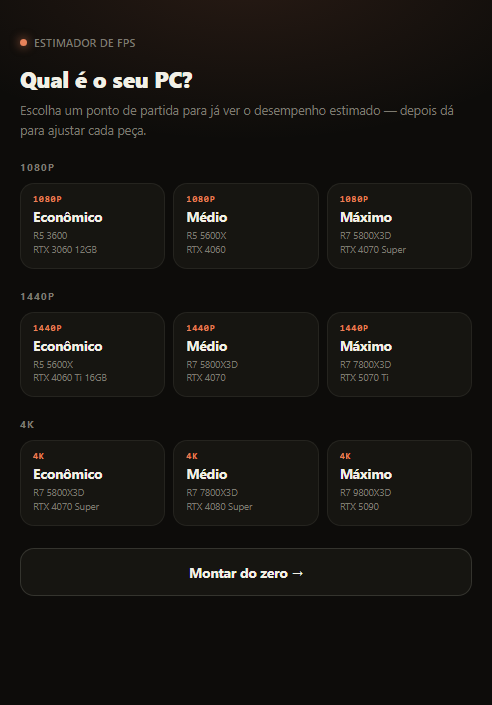
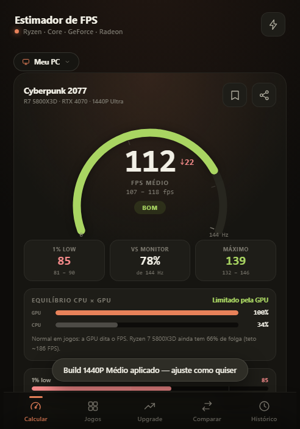
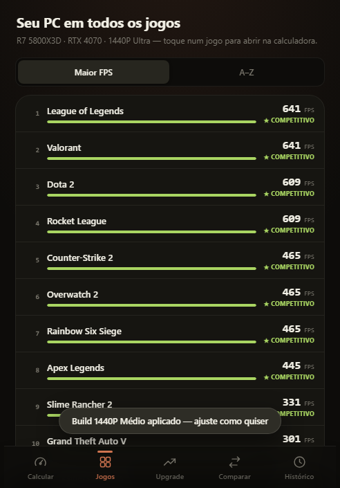
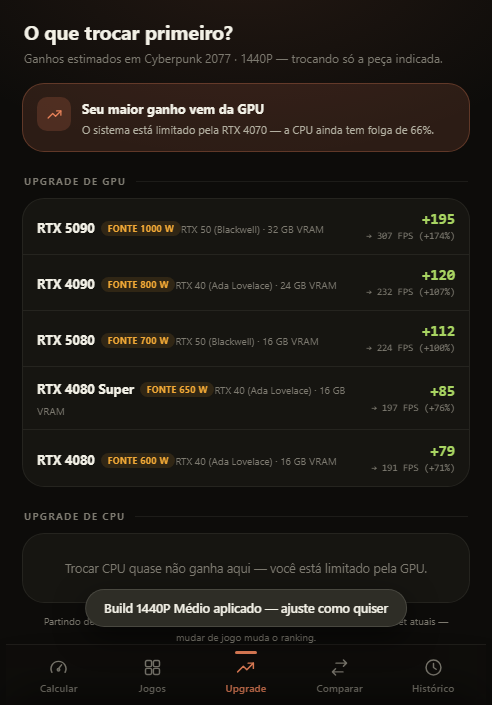

# FPS Calculadora

App Android que estima o desempenho (FPS) de um PC gamer a partir da combinação de CPU e GPU escolhidas, para uma base com dezenas de jogos — sem precisar de internet.

<p align="center">
  
  
  
  
</p>

## Funcionalidades

- **Calculadora de FPS** — escolha CPU (Ryzen/Intel Core), GPU (GeForce/Radeon), resolução (1080p/1440p/4K), taxa de atualização do monitor, preset gráfico, Ray Tracing, Frame Generation e upscaling (DLSS/FSR/XeSS), e veja o FPS médio, 1% low e máximo estimados.
- **Seu PC em todos os jogos** — ranking do FPS estimado da sua build atual em toda a base de jogos cadastrada, ordenável por desempenho ou nome.
- **O que trocar primeiro?** — mostra se o gargalo é CPU ou GPU e quanto cada upgrade de peça ganharia em FPS.
- **Comparar builds** — coloca a build atual lado a lado com uma build salva no histórico.
- **Histórico local** — salva builds no aparelho e permite exportar/importar configurações por código de texto.
- **Recomendação de fonte** — potência mínima e recomendada com selo 80 Plus sugerido para a build.
- Onboarding com presets prontos (Econômico / Médio / Máximo) por resolução, para já sair vendo um resultado.

## Como funciona a estimativa

Os números partem de uma configuração de referência (RTX 5070 + Ryzen 7 5700X + B550 + DDR4 32GB, DLSS Balanceado = escala 1.00×) e aplicam multiplicadores por CPU, GPU, resolução, preset gráfico, Ray Tracing/Frame Generation e upscaling sobre a base de dados de jogos embutida no app. São **estimativas de referência**, não benchmarks — o desempenho real varia por jogo, drivers e configuração específica de cada PC.

## Tecnologia

A interface é uma WebView em tela cheia carregando uma única página HTML/CSS/JS (`app/src/main/assets/www/index.html`), totalmente embutida no APK. Não há chamadas de rede — todo o cálculo, a base de jogos e o histórico rodam localmente no aparelho.

O app está **migrando para UI nativa em Jetpack Compose**. A primeira etapa já está no repositório: o módulo `:core`, em Kotlin puro, com a base de dados em JSON e o cálculo de FPS coberto por testes de paridade que comparam 3.975 combinações de hardware contra a implementação original. Ver [`core/README.md`](core/README.md) e [`docs/FASE-2-HANDOFF.md`](docs/FASE-2-HANDOFF.md).

| | |
|---|---|
| Linguagem | Java (app) · Kotlin (core) |
| UI | WebView + HTML/CSS/JS embutidos — Compose em migração |
| minSdk / targetSdk | 24 / 34 |
| Android Gradle Plugin | 8.2.2 · Gradle 8.9 |

## Estrutura do projeto

```
app/src/main/                                    # módulo Android
├── java/com/fps/calculadora/MainActivity.java   # Activity: WebView em tela cheia
├── assets/www/index.html                        # UI completa (HTML/CSS/JS, dados e lógica)
├── res/                                          # ícones, layout, strings, tema
└── AndroidManifest.xml

core/                                            # módulo Kotlin puro, sem Android
├── src/main/resources/data/*.json               # jogos, CPUs, GPUs, placas-mãe
├── src/main/kotlin/…/FpsCalculator.kt           # o cálculo de FPS
└── src/test/…                                   # testes de paridade contra o JS

tools/*.mjs                                      # extraem os dados e os vetores de teste do index.html
```

## Como rodar

Pré-requisitos: [Android Studio](https://developer.android.com/studio) (recomendado) ou JDK 17+ com Android SDK (`compileSdk 34`).

```bash
git clone https://github.com/Yuumi-32/FpsCalculadora.git
```

Abra a pasta no Android Studio e deixe o Gradle sincronizar (usa o wrapper, sem configuração adicional), depois rode em um emulador ou dispositivo físico.

Ou via linha de comando (o wrapper já vem no repositório, não precisa instalar Gradle):

```bash
./gradlew assembleDebug
```

O APK debug é gerado em `app/build/outputs/apk/debug/` (`applicationId` com sufixo `.debug`).

Para rodar os testes do cálculo de FPS:

```bash
./gradlew :core:test
```

## Aviso

Os valores exibidos são estimativas para referência rápida na hora de montar ou planejar upgrade de um PC, não substituem benchmarks reais.

## Sobre este projeto

Projeto pessoal feito por hobby com apoio de IA, ainda em evolução — sugestões e PRs são bem-vindos.
